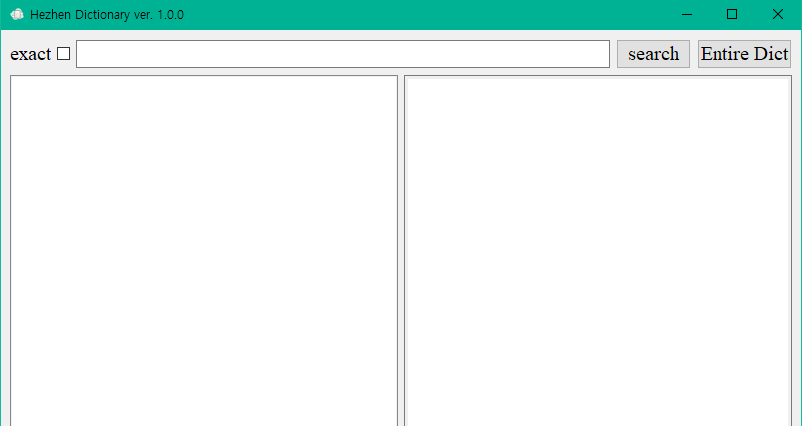

# Sehaan's program: Hezhen Dictionary

|현재 버전|최종 수정일|
|:-------:|:---------:|
|ver. 1.0.0|2022년 1월 17일|

- Icon 출처: https://img.icons8.com/clouds/100/000000/note.png

## 1. Requirements
위 프로그램을 실행하기 위해선 아래에 나열된 것들이 컴퓨터에 설치되어 있어야 합니다.
- Python 3.9.6 이상
- 필수 라이브러리
  |Module|version|
  |:---------:|:-----:|
  |pandas|1.3.5|
  |PyQt5|5.15.6|
  
  위 라이브러리들은 이 레포지토리를 다운받았다면 아래 명령을 통해 한번에 설치할 수 있습니다.
  ```cmd
  pip install -r requirements.txt
  ```
- 허전어 사전: csv 파일이며, **현재는 비공개 상태라 파일이 존재하지 않습니다**. 적절한 사전 데이터가 존재한다면 `source/data`에 `HEZ_211020.csv`라는 이름으로 넣으시면 됩니다.

## 2. 사용법
현재는 아주 간단한 기능만 포함되어 있습니다.<br>



- exact
  - 체크한 상태에서 search를 누르면 문자열이 정확하게 일치하는 어휘들만 찾습니다.
  - 체크를 해제한 상태라면 검색하고자 하는 문자열이 포함되어 있는 어휘들을 모두 찾습니다.
- search
  - 버튼 좌측의 라인 박스에 검색하고 싶은 문자열을 입력하고 버튼을 누르면 됩니다.
  - search를 누르면 하단 좌측의 박스에 리스트가 나열됩니다.
  - 원하는 어휘를 선택하면 하단 우측에 단어의 정의와 설명이 뜹니다.
- Entire Dict
  - 전체 사전을 보여줍니다.
  - 역시 하단 좌측의 박스에 사전의 어휘들이 나열됩니다.

## 3. 입력 방법
IPA 등의 특수문자를 바로 입력할 수 없기 때문에, 일부 문자는 자동으로 해당 문자로 변환됩니다. 대응표는 아래와 같습니다. source/function_encoding.py에도 설명이 있습니다.

|입력|변환|
|:--:|:--:|
|E|ə|
|U|ü|
|O|ö|
|A|ɛ|
|I|ɜ|
|Z|ʐ|
|G|ŋ|